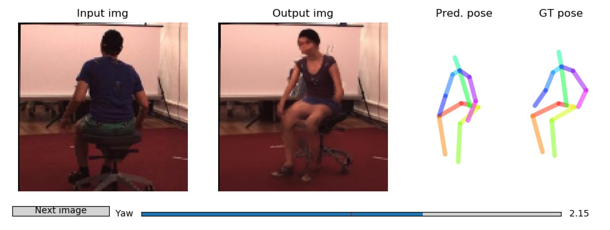

Unsupervised Geometry-Aware Representation Learning for 3D Human Pose Estimation
===================

ECCV paper by Helge Rhodin, Mathieu Salzmann, and Pascal Fua

https://arxiv.org/abs/1804.01110

Please cite the paper in your publications if it helps your research:

    @inproceedings{rhodin2018unsupervised,
      author = {Rhodin, Helge and Salzmann, Mathieu and Fua, Pascal},
      booktitle = {ECCV},
      title = {Unsupervised Geometry-Aware Representation Learning for 3D  Human Pose Estimation},
      year = {2018}
    }
    
Features
===================
Modern 3D human pose estimation techniques rely on deep  networks, which require large amounts of training data. In  this work, we propose to overcome this problem by learning  a geometry-aware body representation from multi-view images without 3D annotations. To this end, we use an encoder-decoder  that predicts an image from one viewpoint given an image  from another viewpoint. Because this representation encodes 3D geometry, using it in a semi-supervised setting makes it  easier to learn a mapping from it to 3D human pose. As  evidenced by our experiments, our approach significantly  outperforms fully-supervised methods given the same amount  of labeled data, and improves over other semi-supervised  methods while using as little as 1% of the labeled data.

The provided pytorch implementation provides
-------------------

* Network definition (image encoder, image decoder and pose decoder)
* Interactive test code
* Training code (requires the H36M dataset)

Minimal Dependencies
===================

For testing a pre-trained model only the following packages are required:
* Pytorch 0.4 (lower versions might work as well) and torchvision
* numpy
* matplotlib
* pickle

Test the pretrained model
=======================

A pre-trained model can then be tested with 
```
python configs/test_encodeDecode.py
```

It outputs synthesized views and 3D pose estimates with matplotlib. Different view angles can be explored interactively through slider input. It should look like this:



Training Dependencies
======================

Training your own model requires more dependencies:
* Ignite (provided in subdirectory)
* Visdom (optional, for graphical display of training progress, https://github.com/facebookresearch/visdom)
* **H3.6M dataset** and dataloader (I provide my own dataloader for reference, but it is based on some preprocessed version of Human3.6Million which I can't share due to the original license.)

Self-supervised Representation Learning 
=======================================

After downloading and file extraction, you should be able to start training by executing the following scrip from within the code root folder.
```
python configs/train_encodeDecode.py
```
There is quite a bit of debug output. Feel free to remove some if you feel like.

It will create an "output/encode_resL3_ResNet_layers4...." folder to monitor the progress (in case you don't use visdom).
Every 5k frames it will evaluate on the test set. This and other settings can be changed in configs/config_dict_encodeDecode.py

Supervised 3D Pose Training
===========================

In the file 'config_train_encodeDecode_pose.py' you have to set the 'network_path' to the output folder of the training through running 'python configs/config_train_encodeDecode.py'

To subsequently run the pose estimation, you simply run
```
python configs/train_encodeDecode_pose.py
```
This second training stage will only train the pose estimation decoder. It keeps the encoder fixed, hence, you first need to train the encoder for a while, 400k iterations are good.

Test your model
=======================

As before, you have to set the 'network_path' in configs/config_test_encodeDecode.py.
The trained model can then be tested as before with 
```
python configs/test_encodeDecode.py
```
You might want to change the test set in configs/test_encodeDecode.py to your own dataset.
